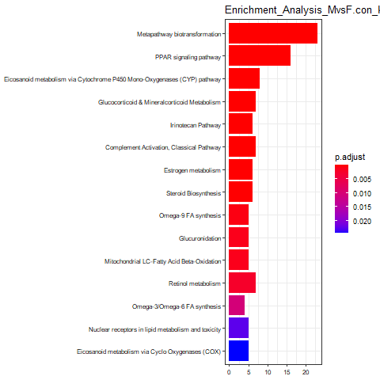

```{r setup, include=FALSE}
knitr::opts_chunk$set(echo = TRUE, message = FALSE, warning = FALSE,
                      comment = NA, prompt = TRUE, tidy = TRUE,
                      tidy.opts=list(width.cutoff=60),
                      fig.width = 7, 
                      fig.height = 7, fig_caption = TRUE, 
                      cache=TRUE)

devtools::install_github('yihui/tinytex')
options(tinytex.verbose = TRUE)
```

```{r libraries, include=FALSE}
if(!require(knitr)) install.packages('knitr',  repos = 'http://cran.rstudio.com')
if(!require(kableExtra)) install.packages('kableExtra',  repos = 'http://cran.rstudio.com')

if(!require(printr)) install.packages('printr', type = 'source',repos = c('http://yihui.name/xran','http://cran.rstudio.com'))
if(!require(ggplot2)) install.packages('ggplot2', repos = 'http://cran.rstudio.com')
if(!require(ggrepel)) install.packages('ggrepel', repos = 'http://cran.rstudio.com')
```

```{r Bioconductor, include=FALSE}
if(!requireNamespace("BiocManager", quietly = TRUE)) 
BiocManager::install()

#Paquetes de Bioconductor necesarios para el análisis:

#BiocManager::install("limma")
#BiocManager::install("GEOquery")
#BiocManager::install("oligo")
#BiocManager::install("pd.mogene.2.1.st")
#BiocManager::install("RSQLite")
#BiocManager::install("arrayQualityMetrics")
#BiocManager::install("pvca")
#BiocManager::install("mogene21sttranscriptcluster.db")
#BiocManager::install("magrittr")
#BiocManager::install("clusterProfiler")
#BiocManager::install("rWikiPathways", update = FALSE)
```

#Abstract

Caveolin-1 (CAV1) es un gen regulador del metabolismo y la acumulación de lípidos. En el presente estudio se pretende evaluar el efecto de suprimir este gen en condiciones normales y en el desarrollo de la enfermedad de hígado graso no alcohólico (NAFLD), provocada por la dieta en ratones macho y hembra. En el estudio no se detectan diferencias de expresión de genes provocadas por la supresión del gen pero sí hay diferencias entre géneros en animales sanos y en animales con NAFLD provocado por dieta. 

#Objetivos

El presente estudio consiste en hacer un análisis de microarrays que consiste en 24 muestras divididas en 8 grupos donde se aplican 3 variables independientes: tipo de dieta (control/MCD), género (hembra/macho), genotipo (wild type/caveolin-1 KO). 

Los objetivos son responder a las siguientes preguntas: 

- ¿Hay diferencias significativas de expresión génica cuando se comparan los ratones de genotipo normal (*wild type*, **wt**) y los del gen Caveolin-1 suprimido (*HepCAV1ko*, **ko**)?

- ¿Qué diferencias se encuentran en los niveles de expresión génica entre animales sanos y animales con enfermedad de hígado graso no alcohólico (NAFLD) provocada por la dieta?

- ¿Qué diferencias de expresión génica hay entre géneros? 

#Materiales y Métodos

##Los Datos

```{r entorno, include=FALSE}
setwd(".")

if(dir.exists("./data")) unlink("./data", recursive = TRUE)

dir.create("data")
dir.create("results")
```

En el presente análisis trabajaremos con los datos del estudio *"Hepatocyte caveolin-1 modulates metabolic gene profiles and functions in non-alcoholic fatty liver disease"* [@Han2020].

En la carpeta *data* almacenamos los archivos de datos crudos de formato .CEL que hemos descargado de la página de información GEO del estudio con el que trabajamos: [https://www.ncbi.nlm.nih.gov/geo/query/acc.cgi?acc=GSE137345](https://www.ncbi.nlm.nih.gov/geo/query/acc.cgi?acc=GSE137345). Los datos crudos se encuentran en el archivo suplementario del estudio "GSE137345_RAW.tar".

```{r obtener CEL, include=FALSE, message=FALSE, warning=FALSE}
untar("GSE137345_RAW.tar", exdir = "./data")

require(GEOquery)

filesunzip <- list.files(path= "./data", full.names = T)
for (i in 1:length(filesunzip)){
  gunzip(filesunzip[i], overwrite = TRUE, remove = TRUE)
}

#Eliminamos el archivo cdf
file.remove("./data/GPL24557_mogene20st_Mm_ENTREZG.cdf")
```

Los datos con los que trabajamos provienen de un estudio de microarrays realizado con 24 muestras de ratones (12 machos y 12 hembras). 
La proteína Caveolin-1 es una proteína estructural de membrana que tiene un papel muy importante en varios procesos del metabolismo y de señalización de las células. En este estudio, se utilizaron ratones modelo con el gen CAV1 suprimido en los hepatocitos específicamente (**HepCAV1ko**). De las 24 muestras, la mitad de los ratones tienen genotipo normal (*wild type*, **wt**) y la otra mitad tienen genotipo **HepCAV1ko**.
La dieta MCD (methionine/choline deficient) es una dieta específica que se aplica a la mitad de los animales 4 semanas antes del experimento para provocarles la enfermedad de hígado graso no alcohólico (*Non-Alcoholic Fatty Liver Disease*, **NAFLD**). La otra mitad de los ratones se mantuvieron con una dieta control para tener 12 ratones sanos. 

Los microarrays son arrays de 1 color de Affymetrix MoGene 2.0 ST Array Chips (Life Technologies, Germany).

Para disponer de más información sobre los datos, descargamos los datos del estudio con el paquete `geoQuery` que descarga automátimcamente el objeto `ExpressionSet` en una lista, con todos los datos disponibles sobre las muestras. Sin embargo los datos de este `ExpressionSet` ya están normalizados, así que utilizaremos los archivos CEL para construir un `ExpressionSet` de los datos crudos. 

```{r geoquery, message = FALSE}
require(GEOquery)
gse <- getGEO("GSE137345", GSEMatrix = TRUE)
esetFromGEO <- gse[[1]]
```

Existen 8 grupos entre los que se distribuyen las 24 muestras. Se hacen comparaciones enter tres caracterísitas, tipo de dieta (control/MCD), género (hembra/macho), genotipo (wild type/caveolin-1 KO). Creamos un archivo "targets" utilizando la información del `ExpressionSet`. Para facilitar la interpretación de los datos también agregamos una columna de nombres cortos y determinamos a qué grupo pertenece cada muestra.

En esta tabla \@ref(fig:targets) podemos ver la distribución de las muestras en grupos según su clasificación: 

```{r targets, echo= FALSE, message= FALSE, warning=FALSE, out.width="linewidth", fig.cap= "Tabla de targets de las muestras crudas"}

groups <- c(rep("conMw", 3), rep("conFw", 3), 
            rep("dietMw", 3), rep("dietFw", 3), 
            rep("conMko", 3), rep("conFko", 3),  
            rep("dietMko", 3), rep("dietFko", 3))
shortNames <- c("conMw1", "conMw2", "conMw3", 
                "conFw1", "conFw2", "conFw3", 
                "dietMw1", "dietMw2", "dietMw3", 
                "dietFw1", "dietFw2", "dietFw3", 
                "conMko1", "conMko2", "conMko3", 
                "conFko1", "conFko2", "conFko3", 
                "dietMko1", "dietMko2", "dietMko3", 
                "dietFko1", "dietFko2", "dietFko3")
fileList <- list.files(path= "./data", full.names = T)
targets <- cbind(fileList, shortNames, groups,
                esetFromGEO$`diet:ch1`, esetFromGEO$`gender:ch1`, esetFromGEO$`genotype:ch1`)
colnames(targets) <- c("Nombre de archivo","Nombre corto", 
                      "Grupo", "Dieta", "Genero", "Genotipo")
targets <- targets[-25,]
write.csv(targets, "./data/targets.csv", row.names = FALSE)

targets_csv <- read.csv2("./data/targets.csv", header = TRUE, sep = ",")

knitr::kable(targets_csv, align= "llclrrr", booktabs = T)
```

Creamos un `ExpressionSet` llamado "EsetRaw" combinando los archivos crudos .CEL con el archivo  "targets":

```{r create espressionset, include=FALSE, echo = FALSE, message=FALSE, warning=FALSE}
library(oligo)
CELfiles <- list.celfiles("./data", full.names = TRUE)
library(Biobase)
my.targets <- read.AnnotatedDataFrame(file.path("./data","targets.csv"), 
                                      header = TRUE, row.names = 1, sep=",") 
EsetRaw <- read.celfiles(CELfiles, phenoData = my.targets)
```


```{r Change Names, echo=FALSE, message = FALSE, warning= FALSE}
make.names(shortNames, unique=TRUE) -> rownames(pData(EsetRaw))
colnames(EsetRaw) <- rownames(pData(EsetRaw))

head(EsetRaw)
```

##Control de calidad de los datos crudos

Una vez hemos cargado los datos correctamente, comprobamos que tienen una calidad adecuada el paquete ArrayQualityMetrics, que lleva a cabo tres pruebas de calidad diferentes. Si uno de los arrays estuviera por encima de cierto umbral definido en la función, lo marcará con un asterisco como valor atípico. Si alguno de los arrays se marca tres veces, debería revisarse concienzudamente y tal vez rechazarse para mejorar la calidad total del experimento. 

```{r array quality metrics raw, echo = FALSE, message= FALSE, warning= FALSE, eval= FALSE}
library(arrayQualityMetrics)
dir.create("./results/QM_EsetRaw")
arrayQualityMetrics(EsetRaw, outdir = "./results/QM_EsetRaw", force = TRUE)
```

Los resultados del análisis de calidad se encuentran en el directorio "QM_EsetRaw", en el archivo "index.html" que abre una página web con un resumen de los análisis. 

Para obtener más información del análisis de componentes principales, volvemos a hacer el mismo análisis, esta vez indicando cuáles son los grupos del experimento para que la aplicación los coloree automáticamente:  

```{r array quality metrics raw GROUP, echo = FALSE, message= FALSE, warning= FALSE, eval= FALSE}
library(arrayQualityMetrics)
dir.create("./results/QM_EsetRawGroup")
arrayQualityMetrics(EsetRaw, outdir = "./results/QM_EsetRawGroup", force=TRUE, intgroup = "X.Grupo.")
```

En este heatmap \@ref(fig:heatmap_EsetRawGroup) la similitud entre arrays. Se aprecian ciertos patrones que son indicativos del agrupamiento de las muestras, tal y como vimos en el plot anterior. Las muestras parecen agruparse por el tipo de dieta y como segundo factor, por el género:

{width=65%}


Visualizamos también la distribución de intensidades de los arrays utilizando boxplots \@ref(fig:Boxplot_EsetRawGroup). Podemos comprobar que las intensidades de los arrays son muy similares:

```{r Boxplot_EsetRawGroup, message=FALSE, fig.align='center', out.width= "100%", fig.cap="Boxplot de distribución intensidades de arrays"}

boxplot(EsetRaw,  which="all", 
         col = c(rep("yellow1", 3), rep("yellow3", 3),
                 rep("hotpink1", 3), rep("hotpink3", 3),
                 rep("olivedrab1", 3), rep("olivedrab3", 3),
                 rep("skyblue1", 3), rep("skyblue3", 3)),
         main="Distribución de intensidades de arrays sin procesar")
```

Hacemos un análisis de componentes principales de los datos crudos \@ref(fig:PCAraw): 

```{r plotPCA3 function, include=FALSE, echo=FALSE}
library(ggplot2)
library(ggrepel)
plotPCA3 <- function (datos, labels, factor, title, scale,colores, size = 1.5, glineas = 0.25) {
  data <- prcomp(t(datos),scale=scale)
  # plot adjustments
  dataDf <- data.frame(data$x)
  Group <- factor
  loads <- round(data$sdev^2/sum(data$sdev^2)*100,1)
  # main plot
  p1 <- ggplot(dataDf,aes(x=PC1, y=PC2)) +
    theme_classic() +
    geom_hline(yintercept = 0, color = "gray70") +
    geom_vline(xintercept = 0, color = "gray70") +
    geom_point(aes(color = Group), alpha = 0.55, size = 3) +
    coord_cartesian(xlim = c(min(data$x[,1])-5,max(data$x[,1])+5)) +
    scale_fill_discrete(name = "Group")
  # avoiding labels superposition
  p1 + geom_text_repel(aes(y = PC2 + 0.25, label = labels),segment.size = 0.25, size = size) + 
    labs(x = c(paste("PC1",loads[1],"%")),y=c(paste("PC2",loads[2],"%"))) +  
    ggtitle(paste("Principal Component Analysis for: ",title,sep=" "))+ 
    theme(plot.title = element_text(hjust = 0.5)) +
    scale_color_manual(values=colores)
  }
```

```{r PCAraw, echo = FALSE, message= FALSE, fig.cap= "Visualización de los dos primeros componentes principales en datos crudos"}
plotPCA3(exprs(EsetRaw), labels = targets_csv$Nombre.corto, factor = targets_csv$Grupo, title = "Datos crudos", scale = FALSE, size = 3, colores = c("yellow1", "yellow3",
            "hotpink1", "hotpink3",
            "olivedrab1", "olivedrab3",
            "skyblue1", "skyblue3"))
```

##Normalización

Realizamos la normalización de los datos mediante el método Robust Miltuchip Analysis: 

```{r normalizacion}
eset_rma <- rma(EsetRaw)
```

##Control de calidad de los datos normalizados

```{r calidad normalizados}
library(arrayQualityMetrics)
arrayQualityMetrics(eset_rma, outdir = file.path("./results", "QM_Norm"), force=TRUE, intgroup = "X.Grupo.")
```

Los resultados del análisis de calidad se encuentran en el directorio "QM_Norm", en el archivo "index.html".

Realizamos también un boxplot y un análisis de componentes principales de los datos normalizados: 

```{r Boxplot_eset_rma, echo= FALSE, message=FALSE, fig.align='center', out.width= "100%", fig.cap="Boxplot de distribución intensidades de arrays normalizadas"}

boxplot(eset_rma,   
         col = c(rep("yellow1", 3), rep("yellow3", 3),
                 rep("hotpink1", 3), rep("hotpink3", 3),
                 rep("olivedrab1", 3), rep("olivedrab3", 3),
                 rep("skyblue1", 3), rep("skyblue3", 3)),
         main="Distribución de intensidades de arrays normalizados")
```


```{r PCA_rma, echo=FALSE, message= FALSE, fig.cap= "Visualización de los dos primeros componentes principales en datos normalizados"}
plotPCA3(exprs(eset_rma), labels = targets_csv$Nombre.corto, factor = targets_csv$Grupo, title = "Datos normalizados", scale = FALSE, size = 3, colores = c("yellow1", "yellow3",
            "hotpink1", "hotpink3",
            "olivedrab1", "olivedrab3",
            "skyblue1", "skyblue3"))
```

###Identificación de lotes

Comprobamos la fecha en que las muestras fueron procesadas: 

```{r Process_date}
library(affyio)

get.celfile.dates(fileList)
```

En nuestro caso todas las muestras se procesaron el mismo día, así que no tenemos que tener en cuenta este factor. 

Hacemos un Principal variation component analysis (PVCA):

```{r BatchDetection, message=FALSE, warning=FALSE}
library(pvca)
pData(eset_rma) <- targets_csv

pct_thershold <- 0.6
batch.factors <- c("Genotipo", "Dieta", "Genero")

pvcaObj <- pvcaBatchAssess(eset_rma, batch.factors, pct_thershold)
```

```{r pltPVCA, include=FALSE, echo=FALSE}
bp <- barplot(pvcaObj$dat, 
              xlab = "Efectos",
              ylab = "Proporción de varianza de media ponderada",
              ylim= c(0,1.1), las = 2,
              main = "Estimación PVCA")
axis(1, at = bp, labels = pvcaObj$label, cex.axis = 0.55, las=2)
values =pvcaObj$dat
new_values = round(values, 3)
text(bp, pvcaObj$dat, labels = new_values, pos = 3, cex = 0.7)
```

##Filtraje no específico (opcional)

Detectamos los genes más variables mediante una representación gráfica de la desviación standard de todos los genes ordenada de menor a mayor: 

```{r SDplot, echo=FALSE}
SDs <- apply (exprs(eset_rma), 1, sd)
SDsOrden <- sort(SDs)
plot(1:length(SDsOrden), SDsOrden, main="Distribución de variabilidad de todos los genes",
     sub="Las líneas verticales representan los percentiles al 90% y 95%",
     xlab="Índice del gen (de menos a más variable", ylab="Desviación standard")
abline(v=length(SDs)*c(0.9,0.95))
```

A continuación, realizamos un filtrado de los genes menos variables: 

```{r Filtering1, results='hide', message=FALSE}
library(genefilter)
library(mogene21sttranscriptcluster.db)
annotation(eset_rma) <- "mogene21sttranscriptcluster.db"
filtered <- nsFilter(eset_rma, 
                     require.entrez = TRUE, remove.dupEntrez = TRUE,
                     var.filter=TRUE, var.func=IQR, var.cutoff=0.75, 
                     filterByQuantile=TRUE, feature.exclude = "^AFFX")
```


```{r FilterResults1, results='hide', echo=FALSE}
names(filtered)
class(filtered$eset)
```

```{r FilterResults2}
print(filtered$filter.log)
eset_filtered <-filtered$eset
```

Tras el filtrado nos quedan `r dim(oligo::exprs(eset_filtered))[1]` genes. Los tenemos ordenados en la variable *eset_filtered*.

```{r SaveData1, results='hide', include = FALSE, message=FALSE}
write.csv(exprs(eset_rma), file="./results/normalized.Data.csv")
write.csv(exprs(eset_filtered), file="./results/normalized.Filtered.Data.csv")
save(eset_rma, eset_filtered, file="./results/normalized.Data.Rda")
```

Los datos normalizados y los filtrados están guardados en el directorio "results". 

##Selección de genes diferencialmente expresados

Tras obtener los datos filtrados y normalizados de la expresión, procedemos a la seleccion de genes diferencialmente expresados. 

```{r CargarDatosFiltrados_Normalizados, include=FALSE}
if (!exists("eset_filtered")) load (file="./results/normalized.Data.Rda")
```

Primero creamos la matriz de diseño del experimento: 

```{r DesignMatrix, message=FALSE}
library(limma)
pDat_eFiltered <- pData(eset_filtered)
designMat<- model.matrix(~0+Grupo, pDat_eFiltered)
Grupos <- as.vector(levels(pDat_eFiltered$Grupo))
colnames(designMat) <- Grupos
print(designMat)
```

Seguimos con el diseño de la matriz de contrastes: necesitaremos hacer 9 contrastes en este estudio: 

- El primero será un contraste entre los datos de ratones macho wt, con dieta control vs MCD, es decir, los ratones sanos vs lo que presentan enfermedad hepática (NAFLD). Lo llamamos "CONvsDIET.Mwt". 
- Comparamos también entre géneros (Macho vs Hembra), necesitaremos 4 contrastes para ello: 

  + Dieta control, genotipo wt: "MvsF.con_wt"
  + Dieta control, genotipo ko: "MvsF.con_ko"
  + Dieta MCD, genotipo wt: "MvsF.diet_wt"
  + Dieta MCD, genotipo ko: "MvsF.diet_ko"
  
- Hacemos comparaciones entre genotipos (wt vs ko), requerimos 4 comparaciones: 

  + Dieta control, macho: "KOvsWT.con_M" 
  + Dieta MCD, macho: "KOvsWT.diet_M"
  + Dieta control, hembra:  "KOvsWT.con_F"
  + Dieta MCD, hembra:  "KOvsWT.diet_F"
  

```{r ContrastsMatrix, echo=FALSE}
cont.matrix <- makeContrasts (CONvsDIET.Mwt = dietMw-conMw,
                              MvsF.con_wt = conMw-conFw,
                              MvsF.con_ko = conMko-conFko,
                              MvsF.diet_wt = dietMw-dietFw,
                              MvsF.diet_ko = dietMko-dietFko,
                              KOvsWT.con_M = conMko-conMw,
                              KOvsWT.diet_M = dietMko-dietMw,
                              KOvsWT.con_F = conFko-conFw,
                              KOvsWT.diet_F = dietFko-dietFw,
                              levels=designMat)
print(cont.matrix)
```

Con estas matrices diseñadas, hacemos la estimación del modelo: 

```{r modelo}
library(limma)
fit<-lmFit(eset_rma, designMat)
fit.main<-contrasts.fit(fit, cont.matrix)
fit.main<-eBayes(fit.main)
class(fit.main)
```

Obtenemos las tablas de la lista de genes ordenados de más a menos diferencialmente expresados en cada una de las 9 comparaciones.

Muestro el código y las primeras líneas del resultado para la primera comparación 

```{r toptab1}
topTab_CONvsDIET.Mwt <- topTable (fit.main, number=nrow(fit.main), coef="CONvsDIET.Mwt", adjust="fdr") 
head(topTab_CONvsDIET.Mwt)
```

```{r toptab2, include=FALSE}
topTab_MvsF.con_wt <- topTable (fit.main, number=nrow(fit.main), coef="MvsF.con_wt", adjust="fdr") 
head(topTab_MvsF.con_wt)
```


```{r toptab3, include=FALSE}
topTab_MvsF.con_ko <- topTable (fit.main, number=nrow(fit.main), coef="MvsF.con_ko", adjust="fdr") 
head(topTab_MvsF.con_ko)
```


```{r toptab4, include=FALSE}
topTab_MvsF.diet_wt <- topTable (fit.main, number=nrow(fit.main), coef="MvsF.diet_wt", adjust="fdr") 
head(topTab_MvsF.diet_wt)
```


```{r toptab5, include=FALSE}
topTab_MvsF.diet_ko <- topTable (fit.main, number=nrow(fit.main), coef="MvsF.diet_ko", adjust="fdr") 
head(topTab_MvsF.diet_ko)
```

```{r toptab6, include=FALSE}
topTab_KOvsWT.con_M <- topTable (fit.main, number=nrow(fit.main), coef="KOvsWT.con_M", adjust="fdr") 
head(topTab_KOvsWT.con_M)
```

```{r toptab7, include=FALSE}
topTab_KOvsWT.diet_M <- topTable (fit.main, number=nrow(fit.main), coef="KOvsWT.diet_M", adjust="fdr") 
head(topTab_KOvsWT.diet_M)
```

```{r toptab8, include=FALSE}
topTab_KOvsWT.con_F <- topTable (fit.main, number=nrow(fit.main), coef="KOvsWT.con_F", adjust="fdr") 
head(topTab_KOvsWT.con_F)
```

```{r toptab9, include=FALSE}
topTab_KOvsWT.diet_F <- topTable (fit.main, number=nrow(fit.main), coef="KOvsWT.diet_F", adjust="fdr") 
head(topTab_KOvsWT.diet_F)
```

##Anotación de los resultados 

Para la anotación de los resultados utilizaremos una función específicamente diseñada que aplicaremos a las 9 tablas de expresión de genes. Guardaremos las tablas de genes anotados en documentos .csv en el fichero "results"

```{r GeneAnnotation, message=FALSE, warning=FALSE}
annotatedTopTable <- function(topTab, anotPackage)
{
  topTab <- cbind(PROBEID=rownames(topTab), topTab)
  myProbes <- rownames(topTab)
  thePackage <- eval(parse(text = anotPackage))
  geneAnots <- select(thePackage, myProbes, c("SYMBOL", "ENTREZID", "GENENAME"))
  annotatedTopTab<- merge(x=geneAnots, y=topTab, by.x="PROBEID", by.y="PROBEID")
return(annotatedTopTab)
}
```

```{r annotateTopTables, include=FALSE}
library(mogene21sttranscriptcluster.db)
topAnnotated_CONvsDIET.Mwt <- annotatedTopTable(topTab_CONvsDIET.Mwt,
anotPackage="mogene21sttranscriptcluster.db")

topAnnotated_MvsF.con_wt <- annotatedTopTable(topTab_MvsF.con_wt,
anotPackage="mogene21sttranscriptcluster.db")
topAnnotated_MvsF.con_ko <- annotatedTopTable(topTab_MvsF.con_ko,
anotPackage="mogene21sttranscriptcluster.db")
topAnnotated_MvsF.diet_wt <- annotatedTopTable(topTab_MvsF.diet_wt,
anotPackage="mogene21sttranscriptcluster.db")
topAnnotated_MvsF.diet_ko <- annotatedTopTable(topTab_MvsF.diet_ko,
anotPackage="mogene21sttranscriptcluster.db")

topAnnotated_KOvsWT.con_M <- annotatedTopTable(topTab_KOvsWT.con_M,
anotPackage="mogene21sttranscriptcluster.db")
topAnnotated_KOvsWT.diet_M <- annotatedTopTable(topTab_KOvsWT.diet_M,
anotPackage="mogene21sttranscriptcluster.db")
topAnnotated_KOvsWT.con_F <- annotatedTopTable(topTab_KOvsWT.con_F,
anotPackage="mogene21sttranscriptcluster.db")
topAnnotated_KOvsWT.diet_F <- annotatedTopTable(topTab_KOvsWT.diet_F,
anotPackage="mogene21sttranscriptcluster.db")

write.csv(topAnnotated_CONvsDIET.Mwt, file="./results/topAnnotated_CONvsDIET.Mwt.csv")

write.csv(topAnnotated_MvsF.con_wt, file="./results/topAnnotated_MvsF.con_wt.csv")
write.csv(topAnnotated_MvsF.con_ko, file="./results/topAnnotated_MvsF.con_ko.csv")
write.csv(topAnnotated_MvsF.diet_wt, file="./results/topAnnotated_MvsF.diet_wt.csv")
write.csv(topAnnotated_MvsF.diet_ko, file="./results/topAnnotated_MvsF.diet_ko.csv")

write.csv(topAnnotated_KOvsWT.con_M, file="./results/topAnnotated_KOvsWT.con_M.csv")
write.csv(topAnnotated_KOvsWT.diet_M, file="./results/topAnnotated_KOvsWT.diet_M.csv")
write.csv(topAnnotated_KOvsWT.con_F, file="./results/topAnnotated_KOvsWT.con_F.csv")
write.csv(topAnnotated_KOvsWT.diet_F, file="./results/topAnnotated_KOvsWT.diet_F.csv")
```

##Comparación entre distintas comparaciones 

Visualizamos los datos de la comparación entre dieta control y dieta MCD en un **Volcano plot**. 

```{r volcanoPlot1, echo = FALSE, fig.cap="Volcano plot para la comparación de ratones macho wild type con dieta control y dieta específica. Se muestran los nombres de los primeros 4 genes de la topTable."}
library(mogene21sttranscriptcluster.db)
geneSymbols <- select(mogene21sttranscriptcluster.db, rownames(fit.main), c("SYMBOL"))
SYMBOLS<- geneSymbols$SYMBOL
volcanoplot(fit.main, coef=1, highlight=4, names=SYMBOLS, 
            main=paste("Differentially expressed genes", colnames(cont.matrix)[1], sep="\n"))
  abline(v=c(-1,1))
```

Generamos los volcano plots de todas las comparaciones para analizarlos en el apartado de resultados. 

```{r volcanoplots_gender, include=FALSE, fig.cap="Volcano plots para las cuatro comparaciones entre géneros." }
library(mogene21sttranscriptcluster.db)
geneSymbols <- select(mogene21sttranscriptcluster.db, rownames(fit.main), c("SYMBOL"))
SYMBOLS<- geneSymbols$SYMBOL

par(mfrow = c(2,2))
volcanoplot(fit.main, coef=2, highlight=4, names=SYMBOLS, 
            main=paste("Differentially expressed genes", colnames(cont.matrix)[2], sep="\n"))
  abline(v=c(-1,1))
volcanoplot(fit.main, coef=4, highlight=4, names=SYMBOLS, 
            main=paste("Differentially expressed genes", colnames(cont.matrix)[4], sep="\n"))
  abline(v=c(-1,1))
  volcanoplot(fit.main, coef=3, highlight=4, names=SYMBOLS, 
            main=paste("Differentially expressed genes", colnames(cont.matrix)[3], sep="\n"))
  abline(v=c(-1,1))
volcanoplot(fit.main, coef=5, highlight=4, names=SYMBOLS, 
            main=paste("Differentially expressed genes", colnames(cont.matrix)[5], sep="\n"))
  abline(v=c(-1,1))
```

```{r volcanoplots_genotype, include=FALSE, fig.cap="Volcano plots para las cuatro comparaciones entre genotipos." }
library(mogene21sttranscriptcluster.db)
geneSymbols <- select(mogene21sttranscriptcluster.db, rownames(fit.main), c("SYMBOL"))
SYMBOLS<- geneSymbols$SYMBOL

par(mfrow = c(2,2))
volcanoplot(fit.main, coef=6, highlight=4, names=SYMBOLS, 
            main=paste("Differentially expressed genes", colnames(cont.matrix)[6], sep="\n"))
  abline(v=c(-1,1))
volcanoplot(fit.main, coef=8, highlight=4, names=SYMBOLS, 
            main=paste("Differentially expressed genes", colnames(cont.matrix)[8], sep="\n"))
  abline(v=c(-1,1))
  volcanoplot(fit.main, coef=7, highlight=4, names=SYMBOLS, 
            main=paste("Differentially expressed genes", colnames(cont.matrix)[7], sep="\n"))
  abline(v=c(-1,1))
volcanoplot(fit.main, coef=9, highlight=4, names=SYMBOLS, 
            main=paste("Differentially expressed genes", colnames(cont.matrix)[9], sep="\n"))
  abline(v=c(-1,1))
```

Los Volcano plots de todas las comparaciones se encuentran un documento pdf llamado "Volcanos.pdf" en el fichero "figures". 

```{r saveVolcanos, include=FALSE}
if(!dir.exists("./figures")) dir.create("./figures")
pdf("figures/Volcanos.pdf")
for (i in colnames(cont.matrix)){
  volcanoplot(fit.main, coef=i, highlight=4, names=SYMBOLS,
              main=paste("Differentially expressed genes",i, sep="\n"))
  abline(v=c(-1,1))
}
dev.off()
```

###Comparaciones múltiples

Realizamos un test de comparaciones múltiples para saber qué genes se encuentran regulados: 

```{r decideTests.1}
library(limma)
decide <-decideTests(fit.main, method="separate", adjust.method="fdr", p.value=0.1, lfc=1)
```

```{r resumeDecideTests}
sum.decide.rows<-apply(abs(decide),1,sum)
decide.selected<-decide[sum.decide.rows!=0,] 
print(summary(decide))
```

Con estas comparaciones podemos comprobar cuántos genes se encuentran regulados en varias de las comparaciones. Con este diagrama de Venn \@ref(fig:vennDiagram_gender) podemos ver los genes que hay en común en las cuatro comparaciones géneros que hemos llevado a cabo. 

```{r vennDiagram_gender, fig.cap="Diagrama de Venn de los genes en las comparaciones de género"}
vennDiagram (decide.selected[,2:5], cex=0.9)
title("Genes en común entre las cuatro comparaciones entre géneros \n Genes seleccionados con FDR < 0.1 and logFC > 1")
```

Generamos un heatmap de los datos de expresión de los genes regulados según las comparaciones múltiples en cada muestra para detectar patrones de sobreexpresión o infraexpresión según las condiciones experimentales. 

```{r data4Heatmap, include= FALSE}
probesInHeatmap <- rownames(decide.selected)
HMdata <- exprs(eset_filtered)[rownames(exprs(eset_filtered)) %in% probesInHeatmap,]

geneSymbols <- select(mogene21sttranscriptcluster.db, rownames(HMdata), c("SYMBOL"))
SYMBOLS<- geneSymbols$SYMBOL
rownames(HMdata) <- SYMBOLS
write.csv(HMdata, file = file.path("./results/data4Heatmap.csv"))
```

```{r heatmapDatExprs, echo = FALSE, fig.cap="Heatmap de los datos de expresión agrupados por similitud"}
heatmap(HMdata)
```

##Análisis de significación biológica(“Gene Enrichment Analysis”)

Realizamos el análisis de significación biológica con el paquete "clusterProfiler", descargando el archivo .gmt que contiene la información del organismo "Mus musculus". [@yu]

```{r seleccionar genes para enrichment, include=FALSE}
listaTablas <- list(CONvsDIET.Mw = topTab_CONvsDIET.Mwt,
                    KOvsWT.con_F = topTab_KOvsWT.con_F,
                    KOvsWT.con_M = topTab_KOvsWT.con_M,
                    KOvsWT.diet_F = topTab_KOvsWT.diet_F,
                    KOvsWT.diet_M = topTab_KOvsWT.diet_M,
                    MvsF.con_ko = topTab_MvsF.con_ko,
                    MvsF.con_wt =  topTab_MvsF.con_wt,
                    MvsF.diet_ko = topTab_MvsF.diet_ko,
                    MvsF.diet_wt = topTab_MvsF.diet_wt)

selectTablas <- function(topTab_X){
  #seleccionar los genes a incluir en el análisis
  genesSelecc <- topTab_X["adj.P.Val"]<0.15
  IDselecc <- rownames(topTab_X)[genesSelecc]
  #convertir ID a Entrez
  EntrezID <- select(mogene21sttranscriptcluster.db, IDselecc, c("ENTREZID"))
  EntrezID <- EntrezID$ENTREZID
}

listIDselec <- lapply(listaTablas, selectTablas)

sapply(listIDselec, length)
```

```{r dataselect comparaciones, include= FALSE}
#selecciono las comparaciones de las que analizar los genes regulados
Genes_CONvsDIET.Mw <- as.vector(unlist(listIDselec[["CONvsDIET.Mw"]]))

Genes_MvsF.con_wt <- as.vector(unlist(listIDselec[["MvsF.con_wt"]]))
Genes_MvsF.con_ko <- as.vector(unlist(listIDselec[["MvsF.con_ko"]]))
Genes_MvsF.diet_wt <- as.vector(unlist(listIDselec[["MvsF.diet_wt"]]))
Genes_MvsF.diet_ko <- as.vector(unlist(listIDselec[["MvsF.diet_ko"]]))

Genes_KOvsWT.con_M <- as.vector(unlist(listIDselec[["KOvsWT.con_M"]]))
Genes_KOvsWT.diet_F <- as.vector(unlist(listIDselec[["KOvsWT.diet_F"]]))
```

```{r enrichment, message=FALSE, warning=FALSE}
library(magrittr)
library(clusterProfiler)
library(rWikiPathways)

wpgmt <- rWikiPathways::downloadPathwayArchive(organism="Mus musculus", format = "gmt")
wp2gene <- clusterProfiler::read.gmt(wpgmt)
wp2gene <- wp2gene %>% tidyr::separate(ont, c("name","version","wpid","org"), "%")
wpid2gene <- wp2gene %>% dplyr::select(wpid, gene) #TERM2GENE
wpid2name <- wp2gene %>% dplyr::select(wpid, name) #TERM2NAME


E_CONvsDIET.Mw <- enricher(Genes_CONvsDIET.Mw, TERM2GENE = wpid2gene, TERM2NAME = wpid2name)
```

```{r enrichment 2, include=FALSE}
E_MvsF.con_wt<- enricher(Genes_MvsF.con_wt, TERM2GENE = wpid2gene, TERM2NAME = wpid2name)
E_MvsF.con_ko <- enricher(Genes_MvsF.con_ko, TERM2GENE = wpid2gene, TERM2NAME = wpid2name)
E_MvsF.diet_wt<- enricher(Genes_MvsF.diet_wt, TERM2GENE = wpid2gene, TERM2NAME = wpid2name)
E_MvsF.diet_ko<- enricher(Genes_MvsF.diet_ko, TERM2GENE = wpid2gene, TERM2NAME = wpid2name)

E_KOvsWT.con_M<- enricher(Genes_KOvsWT.con_M, TERM2GENE = wpid2gene, TERM2NAME = wpid2name)
E_KOvsWT.diet_F <- enricher(Genes_KOvsWT.diet_F, TERM2GENE = wpid2gene, TERM2NAME = wpid2name)
```

Con una función específica creamos gráficos para poder visualizar los datos resultantes del enrichment analysis: 

```{r generatePlots}
library(enrichplot)

generatePlots <- function(enriched, comparacion){
  write.csv(as.data.frame(enriched),
              file = paste0("./results/", "Enriched.", comparacion, ".csv"),
              row.names = FALSE)
    
    png(filename =  paste0("./results/", "Enriched.", comparacion, ".png"))
    print(barplot(enriched, showCategory = 15, font.size = 8,
                  title = paste0("Enrichment_Analysis_", comparacion, ". Barplot")))
    dev.off()
    
    png(filename = paste0("./results/","Enrichment_cnetplot.", comparacion,".png"))
    print(cnetplot(enriched, categorySize = "geneNum", schowCategory = 15, 
         vertex.label.cex = 0.75))
  dev.off()
}
```

```{r generating Plots, include=FALSE}
generatePlots(E_CONvsDIET.Mw, "CONvsDIET.Mw")

generatePlots(E_MvsF.con_wt, "MvsF.con_wt")
generatePlots(E_MvsF.con_ko, "MvsF.con_ko")
generatePlots(E_MvsF.diet_wt, "MvsF.diet_wt")
generatePlots(E_MvsF.diet_ko, "MvsF.diet_ko")

generatePlots(E_KOvsWT.con_M, "KOvsWT.con_M")
```

#Resultados

En el análisis que hicimos previo al filtraje de los genes poco expresados, obtuvimos el siguiente barplot que nos especificaba en qué cantidad influía cada variable en la variabilidad de los datos de expresión de los genes: 

{width=100%}

En este plot ya podemos ver que el genotipo apenas influye en la regulación de la expresión génica, siendo la principal fuente de variación la dieta y la segunda el género. 

En el apartado 3.8 de comparación entre comparaciones hemos obtenido los volcanoplots de todas las comparaciones realizadas en el estudio \@ref(volcanoPlot1). 

Al observar los volcano plots de las comparaciones entre géneros vemos que son bastante similares, lo que nos lleva a confirmar que la variable género tiene mucha influencia en la regulación de los genes. 

{width=100%}

Sin embargo, al comparar los volcano plots de las comparaciones entre genotipos vemos que los puntos se distribuyen mucho más abajo en la gráfica en comparación con los volcano plots de las comparaciones entre género, esto nos confirma que los resultados de regulación de expresión obtenidos de estas comparaciones no serán muy significativos. 

{width=100%}


Lo podemos confirmar definitivamente al hacer la comparación entre comparaciones, donde la tabla ya nos indica que en la mayoría de comparaciones entre genotipos no hay genes cuya expresión cambie significativamente. 

```{r comparacomp}
print(summary(decide))
```

Tan sólo hay un gen sobre-regulado en la comparación de ratones macho con dieta control, relacionado con el citocromo p-450, una proteína involucrada en varios procesos metabólicos. En la comparación de genotipo de ratones hembra sometidos a dieta hay 8 genes infra-regulados, pero no se ha encontrado información biológica al respecto en las bases de datos. 

{width=25%}

En el diagrama de Venn del apartado 3.8.1 \@ref(fig:vennDiagram_gender) podemos ver los genes regulados que tienen en común las cuatro comparaciones entre géneros. 

Al analizar los barplots del Enrichment analysis de las comparaciones entre géneros de los ratones con dieta control vemos que los genes pertenecen a las mismas rutas biológicas. 

{width=50%}{width=50%}

El cambio es notable cuando se compara con los ratones de genotipo normal sometidos a dieta MCD. Claramente la enfermedad provocada por la dieta altera la expresión génica: 

{width=50%}

El número de genes significativament regulados se redice ligeramente en los ratones con genotipo ko y dieta MCD: 

{width=50%}

Sin embargo, la variable que más influye en la variación de expresión génica es la dieta MCD, que provoca la enfermedad NAFLD en los ratones. En ratones macho con dieta control, regula un total de 397 genes. 

{width=100%}

{width=100%}

#Discusión

Con los resultados obtenidos del análisis de estos microarrays se podría llegar a la conclusión de que el genotipo HepCAV1ko no tiene mucha influencia en la expresión de los genes en ratones. Ha de destacarse que en el estudio original [@Han2020] también se compararon los microarrays del presente trabajo con microarrays de una base de datos de ratones con el gen Caveolin-1 suprimido en todo el organismo, no únicamente en los hepatocitos. 
Sería conveniente puntualizar que a pesar de los avances que se están realizando en el campo de la secuenciación y anotación de genes, las bases de datos disponibles siguen estando limitadas. Sin ir más lejos, en este estudio, algunos de los genes en los que se han detectado diferencias de expresión en las comparaciones, no se han podido anotar al comparar sus identificadores con las bases de datos de Gene Ontology (GO) y Kyoto Encyclopedia of Genes and Genomes (KEGG). Sin duda las bases de datos continuarán creciendo gracias al trabajo de los equipos científicos distribuidos por el mundo. 
 
#Apéndice

En la siguiente URL se encuentra el repositorio de github con todos los archivos necesarios para reproducir el estudio y los archivos de resultados: [https://github.com/riorval/ADO_PEC1.git](https://github.com/riorval/ADO_PEC1.git)*


#Bibliografía
